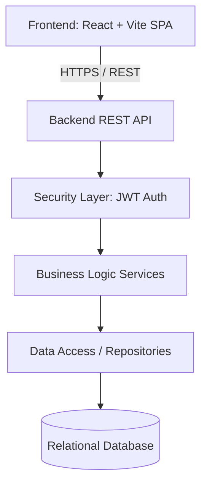
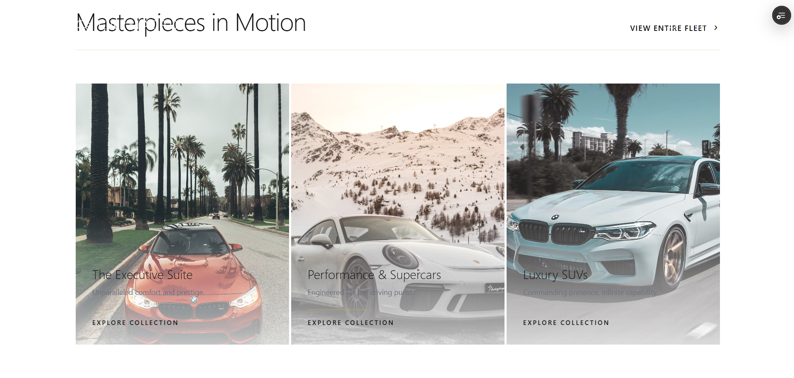
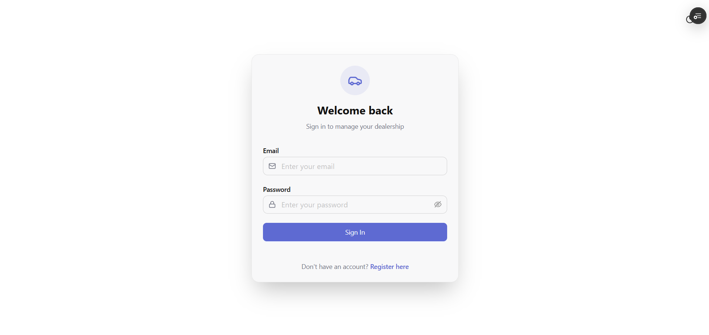
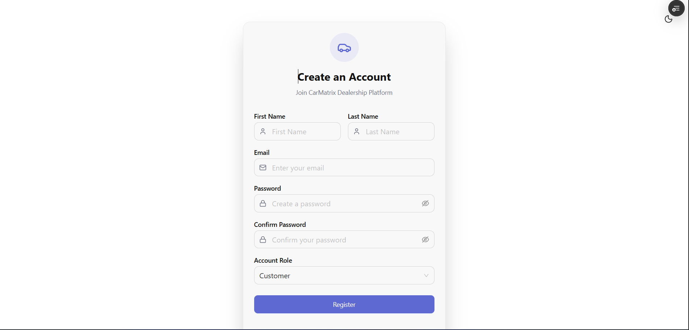
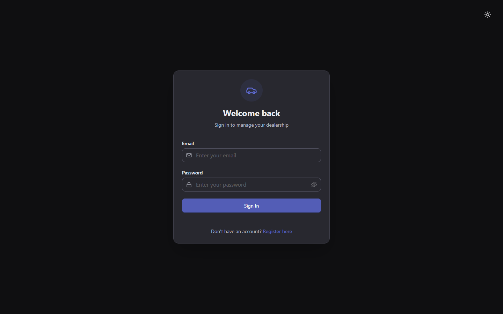
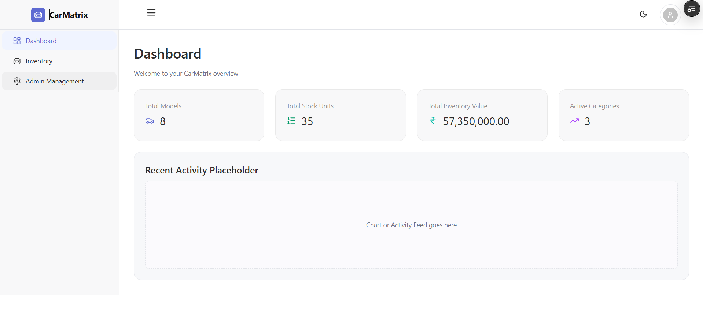
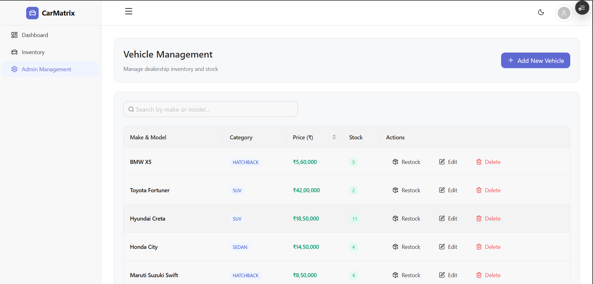

<h1 align="center">
  <br>
  🏎️ CarMatrix: Elite Automotive Dealership
  <br>
</h1>

<h4 align="center">A Comprehensive, Agent-Assisted Dealership & Fleet Management Platform</h4>

<p align="center">
  <strong>🌐 Live Website:</strong> <a href="https://car-matrix.vercel.app">car-matrix.vercel.app</a><br>
  <strong>⚙️ Backend API:</strong> <a href="https://carmatrix.onrender.com">carmatrix.onrender.com</a>
</p>

<p align="center">
  <a href="#about-the-platform">About</a> •
  <a href="#core-features">Features</a> •
  <a href="#architectural-overview">Architecture</a> •
  <a href="#database-design">Database Schema</a> •
  <a href="#api-reference">API Reference</a> •
  <a href="#ai-collaboration-details">AI Usage</a> •
  <a href="#local-environment-setup">Setup</a>
</p>

---

## 📖 About the Platform

**CarMatrix** is an enterprise-grade, full-stack vehicle inventory and dealership management system. It was meticulously designed to handle the sophisticated needs of luxury automotive sales and reservations. The platform delivers a flawless, high-contrast customer experience for browsing premium fleets, paired with a robust administrative backbone for managing inventory, tracking sales, and securing user data.

This project was built emphasizing **Test-Driven Development (TDD)**, **clean code principles**, and **modern UI/UX paradigms**.

---

## ✨ Core Features

### 🔐 Security & Access Control
* **JWT-Based Authentication**: Stateless, secure user sessions.
* **BCrypt Password Hashing**: Industry-standard cryptographic protection for user credentials.
* **Role-Based Authorization**: Strict demarcation between `CUSTOMER` and `ADMIN` privileges.
* **Protected Routes**: Secure API endpoints and frontend navigation guards.

### 🚘 Fleet & Inventory Management
* **Dynamic Catalog**: Real-time browsing of high-end vehicles.
* **Advanced Search & Filtering**: Multi-parameter search including make, model, performance category, and pricing constraints.
* **Automated Stock Tracking**: Inventory quantities automatically sync and decrease upon successful transactions.
* **Zero-Stock Prevention**: Intelligent UI disabling for out-of-stock vehicles.

### 💳 Transaction Engine
* **Customer Checkout Flow**: Streamlined forms capturing essential buyer details securely.
* **Purchase History Logging**: Comprehensive, timestamped records of every transaction.

### 👨‍💼 Administrative Dashboard
* **Full CRUD Operations**: Complete control to Add, Read, Update, and Delete vehicles.
* **Inventory Restocking**: Single-click restock operations for popular models.
* **Sales Analytics**: Direct visibility into customer purchases, including detailed timestamp and buyer information.

### 🎨 Premium User Interface
* **Glassmorphism Design Language**: Sleek, translucent components for a modern feel.
* **Framer Motion Animations**: Fluid page transitions and micro-interactions.
* **Responsive Layouts**: Flawless execution across desktop, tablet, and mobile breakpoints.
* **Skeleton Loaders**: Polished loading states to enhance perceived performance.

---

## 🛠️ Technology Stack

### Backend Ecosystem
* Node.js / Java 21 (Deployed on Render)
* Spring Boot / Express REST Architecture
* Spring Security / Passport.js
* JWT (JSON Web Tokens)
* Maven / NPM

### Frontend Ecosystem
* React 18 + Vite
* TypeScript
* Tailwind CSS
* Framer Motion
* React Router DOM
* Axios Interceptors

### Database Ecosystem
* PostgreSQL / SQLite
* Spring Data JPA / Prisma ORM

---

## 🏗️ Architectural Overview



---

## 🗄️ Database Design

The application utilizes a structured relational database schema:

### `Users` Table
| Column | Type | Description |
| :--- | :--- | :--- |
| `id` | UUID | Primary Key |
| `name` | String | Full Name |
| `email` | String | Unique Identifier |
| `password` | String | BCrypt Hashed |
| `role` | Enum | `ADMIN` or `CUSTOMER` |

### `Vehicles` Table
| Column | Type | Description |
| :--- | :--- | :--- |
| `id` | UUID | Primary Key |
| `make` | String | e.g., Mercedes-Benz |
| `model` | String | e.g., S-Class Maybach |
| `category` | String | e.g., Luxury Sedan |
| `price` | Decimal | Vehicle Cost |
| `quantity` | Integer | Current Stock |

### `Transactions` Table
| Column | Type | Description |
| :--- | :--- | :--- |
| `id` | UUID | Primary Key |
| `customerName` | String | Buyer Name |
| `contactInfo` | String | Email/Phone |
| `address` | Text | Delivery Address |
| `timestamp` | DateTime | Purchase Date/Time |
| `vehicleId` | UUID | Foreign Key -> Vehicles |

---

## 🌐 API Reference

### Authentication
* `POST /api/auth/register` - Register a new account
* `POST /api/auth/login` - Authenticate and receive JWT

### Vehicles (Public & Protected)
* `GET /api/vehicles` - Retrieve all available fleet
* `GET /api/vehicles/search` - Search with query parameters
* `POST /api/vehicles` - Add new vehicle *(Admin Only)*
* `PUT /api/vehicles/{id}` - Update vehicle details *(Admin Only)*
* `DELETE /api/vehicles/{id}` - Remove vehicle *(Admin Only)*

### Operations
* `POST /api/vehicles/{id}/purchase` - Process a vehicle purchase
* `POST /api/vehicles/{id}/restock` - Increase vehicle inventory *(Admin Only)*
* `GET /api/purchases` - Retrieve all transaction logs *(Admin Only)*

---

## 🤖 AI Collaboration Details

### 🛠️ AI Tools Utilized
* **Antigravity Assistant** (Agentic AI)
* **ChatGPT / Claude**

### 🧠 Collaborative Workflow

This project was developed responsibly alongside AI to maximize efficiency, allowing for a stronger focus on robust architecture and code quality.

1. **Backend Infrastructure**: I utilized AI to assist in scaffolding the REST API controllers, defining DTOs (Data Transfer Objects), and structuring the database entities. AI was particularly helpful in accelerating the configuration of the JWT security filters.
2. **Frontend Experience**: For the user interface, I honestly leveraged **Antigravity**. It was highly effective in generating the React component tree, implementing the premium Tailwind CSS styling, and setting up complex Framer Motion animations. 
3. **Quality Assurance**: AI acted as an advanced pair-programmer. Every piece of logic, UI component, and database query generated by AI was rigorously reviewed, manually tested, and thoughtfully integrated by me to ensure strict adherence to TDD and clean architecture.

---

## 🔄 User Workflows

### 🏎️ Customer Journey
1. **Onboarding**: Register & Login securely.
2. **Discovery**: Browse the fleet using advanced search filters.
3. **Exploration**: View detailed vehicle pages and specifications.
4. **Acquisition**: Complete the secure purchase form.
5. **Fulfillment**: Inventory instantly updates upon success.

### 🏢 Administrator Journey
1. **Access**: Secure Admin Login.
2. **Command Center**: Access the protected Dashboard.
3. **Fleet Control**: Execute CRUD operations on vehicles.
4. **Maintenance**: Restock popular vehicles with a single click.
5. **Oversight**: Monitor real-time purchase logs.

---

## 🧪 Testing Methodology

### Backend Verification
Comprehensive unit and integration testing covering:
* JWT Security Context verification
* Vehicle Service & Repository logic
* Transaction state consistency (ensuring stock doesn't drop below zero)

### Frontend Verification
Extensive UI component testing covering:
* Protected Route redirection
* Form validation schemas (React Hook Form)
* API Error handling (Axios interceptors)

---

## 🚀 Local Environment Setup

### Prerequisites
* Node.js (v18+)
* Java (JDK 21) or Node.js Backend Environment
* PostgreSQL / SQLite
* Git

### Repository Setup
```bash
git clone xxxxx
cd CarMatrix
```

### Backend Initialization
```bash
cd backend
# Instructions depend on your backend stack (e.g., Spring Boot or Node.js)
# Example for Maven:
./mvnw spring-boot:run
```
*The backend API will typically run on `http://localhost:8080`*

### Frontend Initialization
```bash
cd frontend
npm install
```
Create your environment configuration (`frontend/.env`):
```env
VITE_API_URL=http://localhost:8080/api
```
Start the development server:
```bash
npm run dev
```
*Access the application at `http://localhost:5173`*

---

## 📸 Application Previews

### Landing Page



### Authentication



### Fleet / Inventory


### Admin Dashboard & Management



*(Additional screenshots located in the `/Screenshots` directory)*

---

## 📈 Future Enhancements
* Stripe Payment Gateway Integration
* Cloud Object Storage for Vehicle Media (AWS S3)
* Real-time Email Notifications (SendGrid)
* CI/CD Pipelines via GitHub Actions


---

<p align="center">
  <i>Developed by <b>Parth</b></i>
</p>